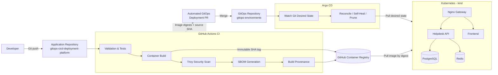

# GitOps CI/CD Platform Architecture



## Deployment Control Flow

```text
Developer
   ↓
Application Git Repository
   ↓
GitHub Actions CI
   ├── validation
   ├── container build
   ├── Trivy scanning
   ├── SBOM
   └── provenance
   ↓
GHCR immutable artifacts
   ↓
Automated GitOps Pull Request
   ↓
GitOps Repository
   ↓
Argo CD
   ↓
Kubernetes
```

## Core Principle

CI builds and publishes artifacts but does **not** deploy directly to Kubernetes.

Git defines the desired deployment state, while Argo CD continuously reconciles the Kubernetes cluster with that state.
